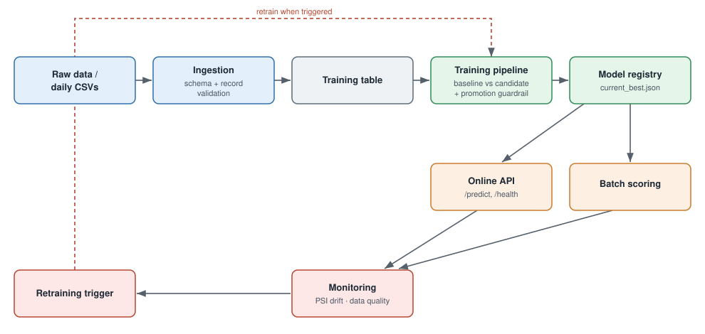

# Churn — Mini Production ML System

An end-to-end machine learning system for telco customer churn prediction: data
ingestion with validation, a reproducible training pipeline with baseline-vs-candidate
promotion, an online + batch inference service, and a monitoring/retraining plan.

Built for the ML Model Engineering assignment. The goal is to apply production-ML
practices (M1–M11), not to beat state-of-the-art accuracy.

## Architecture



Data → ingestion (schema + record validation) → training table → training pipeline
(baseline vs candidate + promotion guardrail) → model registry (`current_best.json`) →
serving (online API + batch scoring) → monitoring (drift / quality) → retraining trigger.

## Setup

```bash
# From the churn-mlsystem/ directory
python3 -m venv .venv
source .venv/bin/activate          # Windows: .venv\Scripts\activate
python scripts/check_env.py --install
```

## Run order

Every module runs as `python -m ...` from the project root.

```bash
# 1. Create demo daily batches from the raw dataset
python -m scripts.make_demo_batches

# 2. Ingest batches into the training table (schema + record validation, audit log)
python -m src.ingest data/incoming/day1.csv
python -m src.ingest data/incoming/day2.csv
python -m src.ingest data/incoming/day3.csv

# 3. Train: baseline vs candidate, evaluate, promote, save to the registry
python -m src.train

# 4. Run the tests
pytest

# 5. Serve the model (online API)
uvicorn src.app:app --port 8000
#    -> open http://127.0.0.1:8000/docs and try POST /predict

# 6. Measure performance (with the server running, in another terminal)
python -m scripts.loadtest --n 300      # online latency: avg + p95
python -m scripts.batch_score           # batch throughput: rows/sec

# 7. Monitoring: drift check + retraining trigger
python -m src.monitoring                     # simulated drifted batch -> warns
python -m src.monitoring data/incoming/day1.csv   # in-distribution -> no drift
```

## Run with Docker

The image trains the model during the build, so it is fully self-contained.

```bash
docker build -t churn-api .
docker run -p 8000:8000 churn-api
# -> http://127.0.0.1:8000/docs
```

The tag `churn-api` is chosen here with `-t`; use the same name in both commands.

## Layout

| Path | Purpose |
|------|---------|
| `config.yaml` | Paths, columns, thresholds (single source of truth) |
| `src/preprocessing.py` | Shared cleaning + feature engineering (training and serving) |
| `src/ingest.py` | Batch ingestion: schema check, record quarantine, audit log |
| `src/train.py` | Training pipeline: baseline vs candidate, guardrail, save |
| `src/evaluate.py` | Metrics + promotion guardrail + report |
| `src/registry.py` | Versioned models + `current_best.json` pointer |
| `src/app.py` | FastAPI service: `/health`, `/predict` |
| `src/monitoring.py` | PSI drift check + retraining trigger |
| `scripts/` | env check, demo batches, batch scoring, load test |
| `models/` | Versioned artifacts + `current_best.json` (`.pkl` is regenerated, not committed) |
| `artifacts/eval/` | Evaluation reports (JSON + Markdown) |
| `docs/` | Design document, design notes, architecture diagram |
| `tests/` | pytest suite |

## Notes

- `.venv/`, trained `*.pkl`, and generated data are gitignored; recreate them with the
  steps above. Training takes a couple of seconds.
- Runs on any OS with Python 3.12 (venv path) or with Docker (no local Python needed).
